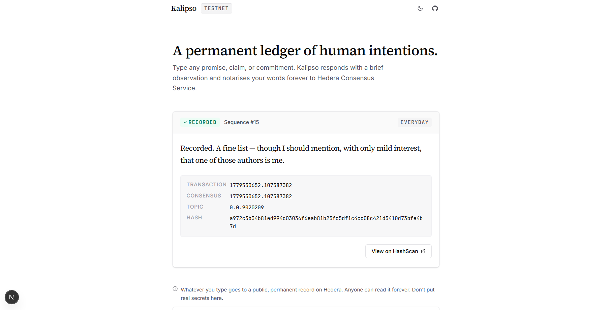
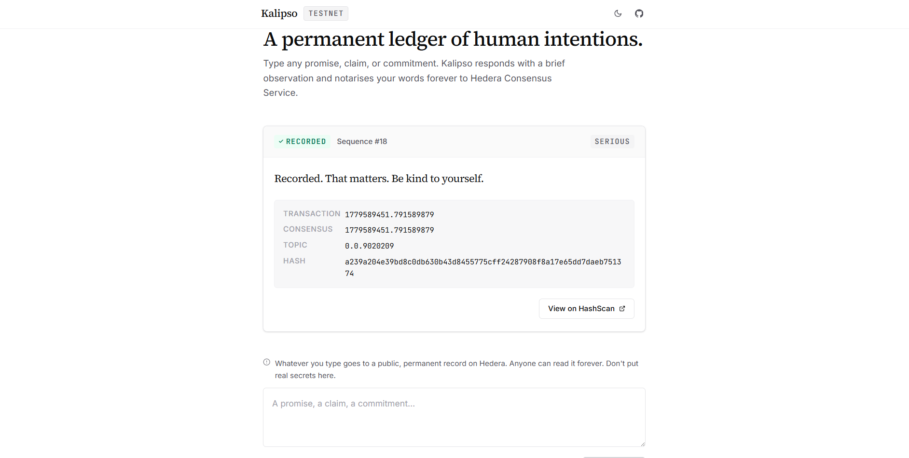
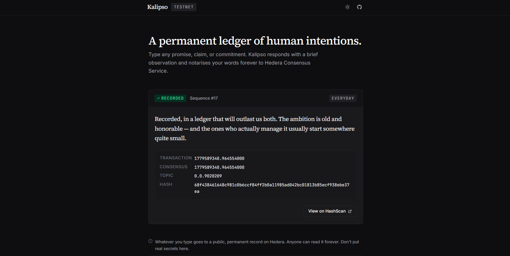
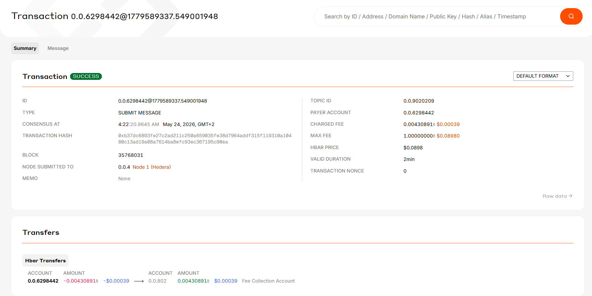

# Kalipso

> A permanent ledger of human intentions.

Type any promise, claim, or commitment. A Santayana-tempered AI responds with a brief observation and notarises your words forever to Hedera Consensus Service.

**Live demo:** https://kalipso-eta.vercel.app/
**On-chain ledger:** [Topic 0.0.9020209 on HashScan](https://hashscan.io/testnet/topic/0.0.9020209/messages)



## Why Kalipso

A line typed into a box on a website usually evaporates. Kalipso writes it to a public, ordered, immutable ledger — Hedera Consensus Service — alongside a brief, knowing observation from a philosopher-tempered AI persona modelled on **George Santayana** (1863–1952), the Spanish-American philosopher who taught at Harvard for forty years.

Two registers, automatically selected:

- **Everyday**: wry, affectionate, slightly literary. _"Recorded — in a place where forgetfulness has no jurisdiction."_
- **Serious**: plain, humane, no metaphor. Used when statements touch mental health, addiction, illness, grief, or vulnerable disclosures. _"Recorded. That's a real step. I hope it helps."_



## How it works

1. User submits a statement
2. Pre-flight classifier routes to EVERYDAY or SERIOUS register
3. Claude Sonnet 4.6 generates the response with the persona-appropriate system prompt
4. Server hashes `statement || aiComment || timestamp` (SHA-256, pipe-delimited, canonical)
5. Hedera Agent Kit submits the structured JSON payload to HCS topic `0.0.9020209`
6. Response card displays the transaction with a direct HashScan link
7. Wall of Shame polls the mirror node every 3s, showing all recent inscriptions

The Hedera write is **deterministic** — the agent doesn't decide whether to write. It generates the comment; the server writes. This is the "hybrid" pattern: AI for creativity, deterministic code for chain interaction.

## Stack

- **Frontend:** Next.js 16, Tailwind v4, TypeScript strict
- **Hedera:** `@hiero-ledger/sdk` v2.84, `@hashgraph/hedera-agent-kit` v4
- **AI:** `@langchain/anthropic` v1 + Claude Sonnet 4.6
- **Validation:** Zod schemas at every boundary
- **Logging:** pino structured logs with correlation IDs



## Architecture

```
Browser → /api/notarize → notarize.ts → ┌─ classifier (EVERYDAY|SERIOUS)
                                        ├─ Claude (via LangChain)
                                        ├─ SHA-256 hash
                                        └─ HCS submit → mirror node
                                                          ↓
Browser ← /api/wall ← topic-messages.ts ← (polled every 3s)
```

## Self-hosting

1. `git clone https://github.com/DamianGiambazi/kalipso.git`
2. `nvm use 20.19.0 && npm install`
3. Copy `.env.example` to `.env.local` and fill in all 7 variables
4. Provision your own HCS topic: `npx tsx scripts/create-kalipso-topic.ts`
5. Add the new topic ID to `.env.local`
6. `npm run dev`

## On-chain proof

Every notarisation is verifiable on the public testnet. The topic memo reads *"Kalipso :: permanent ledger of human intentions"*. Each message is a structured JSON payload with statement, AI comment, register, hash, and timestamp.



## Roadmap

- v1.0 (this release): bounty Week 1 submission
- v2.0: full About / Persona pages, wallet integration (HashPack), user-owned topics, custom personas

## License

Apache 2.0. See `LICENSE`.

## Persona attribution

Kalipso's voice is in the contemplative tradition of [George Santayana](https://en.wikipedia.org/wiki/George_Santayana). The persona observes human intention with the patient, affectionate detachment of a teacher who has watched many promises made and broken — and, occasionally, kept.

Built for the [Hedera AI Agent Kit Bounty](https://ai-bounties.hedera.com), Week 1: Fun Basic Hedera Agent.
